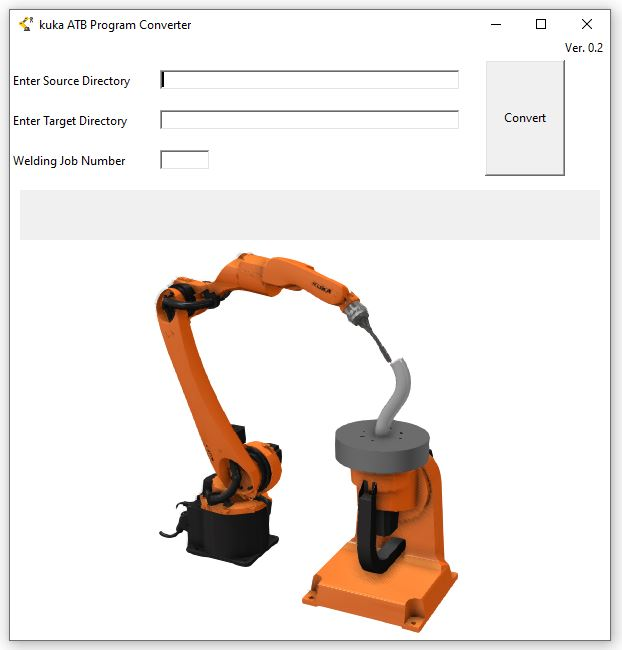

<H1>KUKA Welding Program Converter</H1>

This application is designed to convert additive welding programs into KUKA-specific welding instructions. It was tested using a specific post-processor in AdaOne Adaxis software, generating a program compatible with KUKA ArcTechBasic 3.4.2 (KSS 8.6.x).

<h2>Features</h2>

-Program Conversion: The application converts general additive welding programs into instructions tailored for KUKA robotic systems, particularly for ArcTechBasic 3.4.2.

-Process Handling: It detects ;process_on markers to initiate the ARCON command and ;process_off markers for the ARCOFF command. All lines between these markers are converted into ARCSWI instructions.

-Velocity and Weld Data Management: The software identifies changes in velocity within the welding program and generates specific weld data entries in the .DAT file accordingly.

-User Input: The application allows users to input a job number, which is then automatically updated in the .DAT file.

<h2>Compatibility</h2>  

While the application was initially tested with AdaOne Adaxis software, it is designed to be adaptable and can be used with other path generation software that produces similar welding programs.

**Below is the User interface of the application.**

<h2>How to Use the App</h2>

**Generate the Program:**

-The app has been tested with AdaOne software.

-Use the POST file available in the docs folder (WAAM_PP.adxp) of this repository to generate the program in AdaAxis.

**Run the Application:**

-After generating the program in AdaAxis, run the application executable.

-The application interface will resemble the image provided above.

**Input the Required Paths:**

-Source Directory: Enter the folder path that contains the AdaAxis-generated program in the "Source Directory" section.

-Target Directory: Enter the folder path where the output files should be written in the "Target Directory" section.

**Enter the JOB Number:**

-In the "Job Number" section, specify the JOB number that contains the welding parameters.

**Convert the Program:**

-Once all fields are filled out, click "Convert" to process the program.

**Success:**

Voilà! If everything is right, you'll have your output files ready in the specified target folder.

